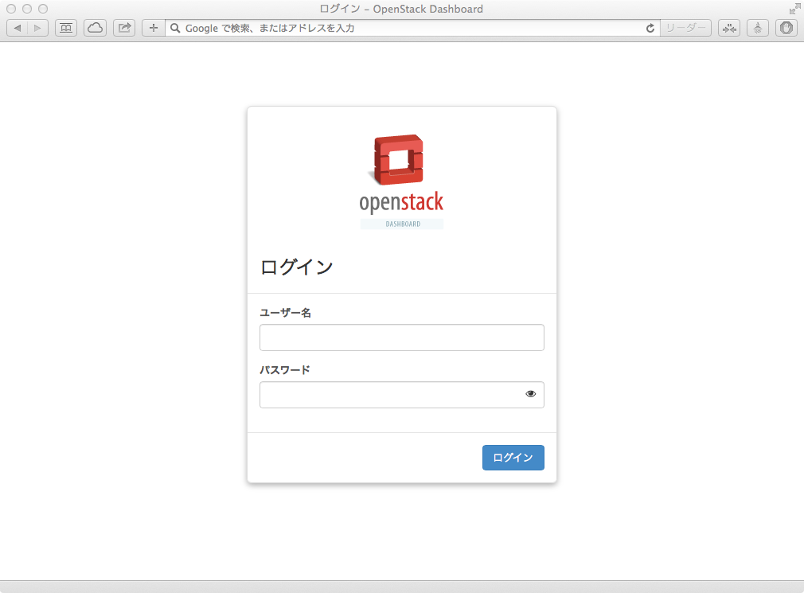

#PackstackによるOpenStackインストールガイド

最終更新日: 2016/12/25


##この文書について
この文書はとりあえず1台に全部入りのOpenStack環境をさくっと構築する場合の手順です。細かいことは省いてしまったので、もう少し細かい手順については次のページの情報などを参考にしてください。

- [Kilo](https://github.com/ytooyama/rdo-kilo)
- Newton (作業中)
- [その他](https://github.com/ytooyama?tab=repositories)


##前提
- Oracle Virtualboxを使用します。（環境のバックアップ、OpenStack構築後のDiskの追加などを行うため）
- 2Core,8GBメモリー,100GBディスク（ディスクVDIで可変）の環境を用意します。
- ホストオンリーネットワークアダプタをOpenStackの管理用アダプタとして使用します。
- OSをインストールし`yum update`して最新の状態にします。
- 固定IPアドレスを設定しておきます。
- 本例はNIC eth1がインターネットゲートウェイと接続されているNICであると想定します（違う場合は読み替えてください）。

##Step 1: インストールまでの流れ

###前準備

PackstackによるOpenStackのデプロイを行う前に、下記を参考に準備しておいてください。

- [Packstack 準備編]

最終更新日: 2016/12/25


##この文書について
この文書はとりあえず1台に全部入りのOpenStack環境をさくっと構築する場合の手順です。細かいことは省いてしまったので、もう少し細かい手順については次のページの情報などを参考にしてください。

- [Kilo](https://github.com/ytooyama/rdo-kilo)
- Newton (これだよぉん)
- [その他](https://github.com/ytooyama?tab=repositories)
- [VirutalboxでのMitaka版の設定参考](http://qiita.com/mfujita/items/ee2da9d1e241926fc790)


##前提
- 
- 2Core,8GBメモリー,100GBディスク(Oracle Virtualbox,VDIディスク,可変）の環境を用意します。
- ホストオンリーネットワークアダプタの作成（Virtual Box側の設定）
- 固定IPアドレスを設定しておきます。
````
# cat ifcfg-eth0
TYPE=Ethernet
BOOTPROTO=none
DEFROUTE=yes
IPV4_FAILURE_FATAL=no
IPV6INIT=yes
IPV6_AUTOCONF=yes
IPV6_DEFROUTE=yes
IPV6_FAILURE_FATAL=no
NAME=eth0
UUID=xxxxxxxxxxxxxxxxxxxxxx
DEVICE=eth0
ONBOOT=yes
IPADDR=192.168.56.101
PREFIX=24
IPV6_PEERDNS=yes
IPV6_PEERROUTES=yes
IPV6_PRIVACY=no
````
- 本例はNIC eth1がインターネットゲートウェイと接続されているNICであると想定します（違う場合は読み替えてください）。

##Step 1: インストールまでの流れ

###OSのインストールとアップデート
- CentOS 7.xを最小インストールして、アップデートを行っておきます。
- [CentOS7のインストール作業参考手順](http://www.kakiro-web.com/memo/centos-install.html)
- インストーラーの起動画面が起動したら、「tabキー」を押し、kernelコマンド行の末尾に”biosdevname=0 net.ifnames=0"を設定すること。
- ストレージの選択のパーティション構成を「自動のパーティション構成」を選択せず、パーティション構成を行いたいを選択し、「/」配下に多くの割当を行うこと。

### NTP設定を行う
- chronydを導入する。
````
# yum install chrony
# vi /etc/chrony.conf
 Use public servers from the pool.ntp.org project.
# Please consider joining the pool (http://www.pool.ntp.org/join.html).
#server 0.centos.pool.ntp.org iburst コメントアウト
#server 1.centos.pool.ntp.org iburst　コメントアウト
#server 2.centos.pool.ntp.org iburst　コメントアウト
#server 3.centos.pool.ntp.org iburst　コメントアウト
server ntp.nict.jp iburst　　　<-追加
server ntp1.plala.or.jp iburst <-追加
:wq
# systemctl restart chronyd.service
# systemctl enable chronyd.service
# systemctl status chronyd.service
# chronyc sources
210 Number of sources = 2
MS Name/IP address         Stratum Poll Reach LastRx Last sample
===============================================================================
^* ntp-b3.nict.go.jp             1  10   377   116   -738us[-1032us] +/- 7001us
^- ntp1.plala.or.jp              4  10   377   123  -2524us[-2818us] +/-  135ms
のようになること。
````

###言語設定を行う
標準出力およびエラー出力を英語で出力するために次の設定を行います。

````
# vi /etc/environment
LANG=en_US.utf-8
LC_ALL=en_US.utf-8
````

###ネットワーク設定の変更
- ファイル　→　環境設定　→　ネットワーク でホストオンリーネットワークのタブで作成
- ホストオンリーアダプタには固定IPアドレスを設定します。
- 名前は適当に、IP:192.168.56.1、サブネットマスク 255.255.255.0、 DHCPは無効とする。
- ifcfg-"NIC"にDEVICEパラメーターを追記します。

(例)

````
....
NAME="eth1"
DEVICE="eth1" #追加
````

- IPアドレスの設定を適用します。うまく反映されない場合は再起動してください。

````
# ifdown eth1;ifup eth1
````

###リポジトリーパッケージのインストール

Kilo以降、CentOS 7ではCloudSIGプロジェクトがCentOSユーザー向けにパッケージを用意しています。RDOプロジェクトが用意するパッケージも利用できます。

RHEL7およびCentOS 7以外のRHEL7クローンでは、RDOプロジェクトが用意するリポジトリーパッケージをインストールすることでOpenStackのインストールが可能になります。

両者の違いとしては、RDO版のパッケージの方がCloudSIG版よりも少々新しい点です。

---

- Newton をインストールする場合

以下のコマンドでRDOリポジトリーのパッケージを利用できます(Fedoraはサポートされません)。

CentOS 7ではCloudSIGプロジェクトがメンテナンスしているリポジトリーを利用できます。

````
# yum install -y centos-release-openstack-newton
````
---

###システムアップデートとパッケージのインストール

````
# yum update -y && yum install -y openstack-packstack
````


###PackstackによるOpenStackのデプロイ

リポジトリーパッケージのインストール終わったら、次の「PackstackによるOpenStackのデプロイ」に進みます。


###PackstackによるOpenStackのデプロイ

下記を実行することで1台のマシンにOpenStackコンポーネントをインストールできます。

````
# setenforce 0
# packstack --dry-run --allinone --default-password=password \
--os-manila-install=n --os-aodh-install=y --os-gnocchi-install=y \
--os-sahara-install=n --os-heat-install=y --os-trove-install=n \
--os-ironic-install=n --nagios-install=n --os-neutron-lbaas-install=y \
--neutron-fwaas=y --os-heat-cfn-install=y --os-cinder-install=y \
--os-swift-install=y --os-ceilometer-install=y --os-client-install=y \
--provision-tempest=y 

 **** Installation completed successfully ******
````

注1...RDOコミュニティによるFedoraのサポートはkiloバージョンまでです。

--provision-demo=yとすると、デモ用のネットワークやユーザーなどが作られ、OpenStackの一通りの操作をすぐ実行できます。ただしデモ用のネットワークはクローズドなので、外部からアクセス不可（後でそれを可能にするには、Neutronネットワークの作り直しが必要）なので注意。

エラーが出ず、インストールが正常に完了すれば「Installation completed successfully」と表示されます。

- ゲートウェイが設定されている方で待ち受けしてしまうのでanswerファイルのIPアドレスを書き換えます。
````
# sed -i -e 's/10.0.2.15/192.168.56.101/g' packstack-answers-*.txt
````
- FWaaSなどのサービスを有効にします。
````
# vi packstack-answers-*.txt を実行し以下のパラメータを変更する。
 # Specify 'y' to install OpenStack Networking's Load-Balancing-
 # as-a-Service (LBaaS). ['y', 'n']
-CONFIG_LBAAS_INSTALL=n
+CONFIG_LBAAS_INSTALL=y

 # Specify 'y' to configure OpenStack Networking's Firewall-
 # as-a-Service (FWaaS). ['y', 'n']
-CONFIG_NEUTRON_FWAAS=n
+CONFIG_NEUTRON_FWAAS=y
　　　　：
 # Password used by Orchestration service user to authenticate against
 # the database.
-CONFIG_HEAT_DB_PW=PW_PLACEHOLDER
+CONFIG_HEAT_DB_PW=password
　　　：
 # Password to use for the Orchestration service to authenticate with
 # the Identity service.
-CONFIG_HEAT_KS_PW=PW_PLACEHOLDER
+CONFIG_HEAT_KS_PW=password
　　　：
 # Password for the Identity domain administrative user for
 # Orchestration.
-CONFIG_HEAT_DOMAIN_PASSWORD=PW_PLACEHOLDER
+CONFIG_HEAT_DOMAIN_PASSWORD=password
　　　：
 # Specify 'y' to configure the OpenStack Integration Test Suite
 # (tempest) for testing. The test suite requires OpenStack Networking
 # to be installed. ['y', 'n']
-CONFIG_PROVISION_TEMPEST=n
+CONFIG_PROVISION_TEMPEST=y
　　　：
 # CIDR network address for the floating IP subnet.
 CONFIG_PROVISION_DEMO_FLOATRANGE=172.24.4.224/28
     :
-CONFIG_TEMPEST_HOST=
+CONFIG_TEMPEST_HOST=192.168.56.101
　　　　：
 # Password to use for the Integration Test Suite provisioning user.
+CONFIG_PROVISION_TEMPEST_USER_PW=password
         :
 CONFIG_GNOCCHI_KS_PW=password
         :
 # IP address of the server on which to install MongoDB.
-CONFIG_MONGODB_HOST=192.168.56.110
+CONFIG_MONGODB_HOST=192.168.56.101
　　　　　　　：
 # IP address of the server on which to install the Redis server.
-CONFIG_REDIS_HOST=192.168.56.110
+CONFIG_REDIS_HOST=192.168.56.101

````
- カーネルパラメータの変更
````
# vi /etc/sysctl.conf
net.ipv4.ip_forward = 1
net.ipv4.conf.all.rp_filter = 0
net.ipv4.conf.default.rp_filter = 0
net.bridge.bridge-nf-call-arptables = 1
net.bridge.bridge-nf-call-iptables = 1
net.bridge.bridge-nf-call-ip6tables = 1
:wq
# sysctl -p
````
- SELINUXの無効化
````
# vi /etc/selinux/config
SELINUX=permissive
:wq
````

- NetworkManagerからnetworkサービスへの切り替え

Packstackの構築完了後に切り替えを行います。

- セキュリティ関連の設定変更

```` 
# systemctl disable firewalld && systemctl stop firewalld
# systemctl disable NetworkManager
# systemctl enable network
# systemctl stop NetworkManager;systemctl start network
````
- 


##Step 2: ブラウザーでアクセス

インストール後に表示されるDashboardのURLにブラウザでアクセスしてみます。ユーザー=admin、パスワード=passwordでログインできます。

/rootディレクトリー上にkeystonerc_adminというRCファイルが作られており、そのファイルでも確認できます。




##Step 3: ネットワーク設定の変更

次に外部と通信できるようにするための設定を行います。外部ネットワークとの接続を提供するノード(ネットワークノード、1台構成時はそのマシン)に仮想ネットワークブリッジインターフェイスであるbr-exを設定します。

本例ではホストに二つのNICがあり、eth1がインターネット側につながっている場合を例とします。eth1にゲートウェイが設定されていることを確認します。

###◆public用として使うNICの設定ファイルを修正
Packstackコマンド実行後、eth1をbr-exにつなぐように設定をします(※BOOTPROTOは設定しない)

eth1からIPアドレス、サブネットマスク、ゲートウェイの設定を削除して次の項目だけを記述し、br-exの方に設定を書き込みます｡

````
# vi /etc/sysconfig/network-scripts/ifcfg-eth1
DEVICE=eth1
ONBOOT=yes
HWADDR=xx:xx:xx:xx:xx:xx # Your eth1's hwaddr
TYPE=OVSPort
DEVICETYPE=ovs
OVS_BRIDGE=br-ex
````

###◆ブリッジインターフェイスの作成
br-exにeth1のIPアドレスを設定します。

````
# vi /etc/sysconfig/network-scripts/ifcfg-br-ex
DEVICE=br-ex
ONBOOT=yes
DEVICETYPE=ovs
TYPE=OVSBridge
OVSBOOTPROTO=dhcp
OVSDHCPINTERFACES=eth1 #インターネットに接続されている方のデバイス
#OVSBOOTPROTO=none
#IPADDR=10.0.2.5
#NETMASK=255.255.255.0  # netmask
#GATEWAY=10.0.2.15      # gateway
#DNS1=8.8.8.8           # nameserver
#DNS2=10.0.1.1
````

###◆SELinuxの設定
SELinuxが有効の状態でも動作するように調整します。All-in-Oneでインストールしたので、次の設定を追加します。

````
# setsebool -P httpd_use_openstack on
# setsebool -P neutron_can_network on
# setsebool -P glance_api_can_network on
# setsebool -P swift_can_network on
````

###◆再起動
ここまでできたらいったんホストを再起動します。

````
# reboot
````

###◆動作確認
Packstackインストーラーによるインストール時にエラー出力がされなければ問題はありませんが、念のためbr-exとNova、Neutronエージェントが導入されてかつ正しく認識されていることを確認しましょう。

まずは再起動後にbr-exが正しく動作し、外のネットワークとつながっていることを確認します。

````
# ip a s br-ex | grep inet
    inet 10.0.2.15/24 brd 10.0.1.255 scope global dynamic br-ex
    inet6 fe80::a00:27ff:fe20:757d/64 scope link
# ping 8.8.8.8 -c 3 -I br-ex | grep "packet loss"
PING 8.8.8.8 (8.8.8.8) from 10.0.2.15 br-ex: 56(84) bytes of data.
64 bytes from 8.8.8.8: icmp_seq=1 ttl=63 time=26.8 ms
64 bytes from 8.8.8.8: icmp_seq=2 ttl=63 time=23.4 ms
64 bytes from 8.8.8.8: icmp_seq=3 ttl=63 time=21.1 ms
--- 8.8.8.8 ping statistics ---
3 packets transmitted, 3 received, 0% packet loss, time 2001ms
````

パケットロスがないことを確認します。

つぎに、OpenStack NovaコンポーネントのステートがOKであることを確認します。

````
# source /root/keystonerc_admin
(adminユーザー認証情報を読み込む)
(keystone_admin)]# nova service-list
+----+------------------+--------------+----------+---------+-------+--
| Id | Binary           | Host         | Zone     | Status  | State | 
+----+------------------+--------------+----------+---------+-------+--
| 3  | nova-cert        | cent7-node1  | internal | enabled | up    | 
| 4  | nova-consoleauth | cent7-node1  | internal | enabled | up    | 
| 5  | nova-scheduler   | cent7-node1  | internal | enabled | up    | 
| 6  | nova-conductor   | cent7-node1  | internal | enabled | up    | 
| 7  | nova-compute     | cent7-node1  | nova     | enabled | up    | 
+----+------------------+--------------+----------+---------+-------+--
````

最後に、NeutronのエージェントがOKであることを確認します。

````
(keystone_admin)]# neutron agent-list -c agent_type -c host -c alive
+--------------------+--------------+-------+
| agent_type         | host         | alive |
+--------------------+--------------+-------+
| Metering agent     | cent7-node1  | :-)   |
| Open vSwitch agent | cent7-node1  | :-)   |
| L3 agent           | cent7-node1  | :-)   |
| DHCP agent         | cent7-node1  | :-)   |
| Metadata agent     | cent7-node1  | :-)   |
+--------------------+--------------+-------+
````


##この後の設定について

次にNeutron Networkを作成します。「Neutron ネットワークの設定」の手順に従って、Neutronネットワークを作成してください。

#RDO Neutron ネットワークの設定

最終更新日: 2016/05/24

##この文書について
この文書は構築したOpenStack環境にNeutronネットワークを作成する手順と作成したネットワークの確認方法の一例を説明しています。

##Step 1: ネットワークの追加
br-exにeth1を割り当てて、仮想マシンをハイパーバイザー外部と通信できるようにする為の経路が確保されていることを確認します。

````
# ovs-vsctl show
afef173b-1bd9-424a-a51e-957d4b1f1239
    Manager "ptcp:6640:127.0.0.1"
        is_connected: true
    Bridge br-tun
        Controller "tcp:127.0.0.1:6633"
            is_connected: true
        fail_mode: secure
        Port patch-int
            Interface patch-int
                type: patch
                options: {peer=patch-tun}
        Port br-tun
            Interface br-tun
                type: internal
    Bridge br-ex
        Port br-ex
            Interface br-ex
                type: internal
        Port "eth1"
            Interface "eth1"
        Port "qg-252fe9f0-b9"
            Interface "qg-252fe9f0-b9"
                type: internal
    Bridge br-int
        Controller "tcp:127.0.0.1:6633"
            is_connected: true
        fail_mode: secure
        Port patch-tun
            Interface patch-tun
                type: patch
                options: {peer=patch-int}
        Port "qr-89b43179-26"
            tag: 1
            Interface "qr-89b43179-26"
                type: internal
        Port br-int
            Interface br-int
                type: internal
        Port "qvo6d9ee7a7-c6"
            tag: 1
            Interface "qvo6d9ee7a7-c6"
        Port "tapfc9417f2-d5"
            tag: 1
            Interface "tapfc9417f2-d5"
                type: internal
    ovs_version: "2.5.0"
````

OSやハードウェア側の設定が終わったら、OpenStackが利用するネットワークを作成してみましょう｡OpenStackにおけるネットワークの設定は以下の順で行います｡

1. ルーターを作成
2. ネットワークを作成
3. ネットワークサブネットを作成

OpenStackの環境構成をコマンドで実行する場合は、/root/keystonerc_adminファイルをsourceコマンドで読み込んでから実行してください｡

````
# source keystonerc_admin
````

それでは順に行っていきましょう｡

###◆ルーターの作成
ルーターの作成は次のようにコマンドを実行します。

````
# neutron router-create router1
````

###◆ネットワークの作成
ネットワークの作成は次のようにコマンドを実行します。

- テナントリストを確認

登録済みのテナントを確認して、ネットワーク作成時に指定するテナントを検討します｡openstackコマンドでテナントの一覧を見るには、"openstack project list"を実行します。

````
# openstack project list
+----------------------------------+----------+
| ID                               | Name     |
+----------------------------------+----------+
| 08114e2588b14949bcf20115e7ae8a41 | admin    |
| 30f2cc33d5f8405895e5558b077a86c6 | services |
+----------------------------------+----------+
````

- パブリックネットワークの作成


本例ではtenant-idはadminのものを指定します｡

````
# neutron net-create public --router:external --tenant-id 08114e2588b14949bcf20115e7ae8a41
````

net-createコマンドの先頭にはまずネットワーク名を記述します｡
tenant-idは「keystone tenant-list」で出力される中から「テナント」を指定します。
router:externalは外部ネットワークとして指定するかしないかを設定します｡
プライベートネットワークを作る場合は指定する必要はありません｡

- プライベートネットワークの作成
本例ではtenant-idはserviceのものを指定します｡

````
# neutron net-create demo-net --shared --tenant-id 30f2cc33d5f8405895e5558b077a86c6
````

ネットワークを共有するには--sharedオプションを付けて実行します｡

###◆ネットワークサブネットの登録
publicネットワークで利用するサブネットを定義します｡

````
# neutron subnet-create --name public_subnet --enable_dhcp=False \
--allocation-pool=start=10.0.2.20,end=10.0.2.50 --gateway=10.0.2.15 public 10.0.2.0/24
Created a new subnet:
（略）
````

これでpublic側ネットワークにサブネットなどを登録することができました｡
次にdemo-net（プライベート）側に登録してみます。

````
# neutron subnet-create --name demo-net_subnet --enable_dhcp=True \
--allocation-pool=start=192.168.2.100,end=192.168.2.254 --gateway=192.168.2.1 \
--dns-nameserver 8.8.8.8 demo-net 192.168.2.0/24
Created a new subnet:
（略）
````

###◆ゲートウェイの設定
作成したルーター(router1)とパブリックネットワークを接続するため、「ゲートウェイの設定」を行います｡

````
# neutron router-gateway-set router1 public
Set gateway for router router1
````


###◆外部ネットワークと内部ネットワークの接続
最後にプライベートネットワークを割り当てたインスタンスがFloating IPを割り当てられたときに外に出られるようにするために「ルーターにインターフェイスの追加」を行います｡

````
# neutron router-interface-add router1 subnet=demo-net_subnet
Added interface xxxx-xxxx-xxxx-xxxx-xxxx to router router1.
````

routerはneutron router-listコマンドで確認、サブネットはneutron subnet-listコマンドで確認することができます。


##Step 2: 仮想ルーターが作られたか確認
neutronコマンドでネットワークを定義したことで仮想ルーター(qrouter)が作られていることを確認します。neutron-l3-agentサービスを実行しているノードで確認します。

````
# ip netns
qrouter-43cad32d-03b5-4059-b3a3-2a59586392f7
qdhcp-bee1692b-07ff-4baa-a971-85c5b307bc40

# ip netns exec `ip netns|grep qrouter` ip r
default via 10.0.2.15 dev qg-252fe9f0-b9
10.0.2.0/24 dev qg-252fe9f0-b9  proto kernel  scope link  src 10.0.2.20
192.168.2.0/24 dev qr-89b43179-26  proto kernel  scope link  src 192.168.2.1

# ip netns exec `ip netns|grep qrouter` \
 ping -c 3 -I qg-252fe9f0-b9 10.0.2.20


# ip netns exec `ip netns|grep qrouter` \
 ping -c 3 -I qg-fdf68416-44 192.168.1.1

# ip netns exec `ip netns|grep qrouter` \
 ping -c 3 -I qg-252fe9f0-b9 8.8.8.8 

# ip netns exec `ip netns|grep qrouter` \
 ping -c 3 -I qr-89b43179-26 192.168.2.1
````

pingコマンドが通れば、外部ネットワークと接続がうまくいっていると判断できます。


##番外:気をつける点など 
- CentOS 7のApache設定はデフォルトでKeepAlive Offなので、Onにしたほうがいいかもしれない。

````
# vi /etc/httpd/conf/httpd.conf
...
KeepAlive On
...
# systemctl restart httpd
````

- IP設定でMACアドレスの記述を忘れずに

NetworkManagerが動いている場合はHWADDRがなくてもうまく動きますが、networkサービスに切り替えた時に、運が悪いとNICデバイス名が変わって通信できなくなります。すべてのNIC設定にHWADDRを付加して再起動すると復旧できます。


````
...
HWADDR=xx:xx:xx:xx:xx:xx
````

- Unable to establish connection to http://xxx.xxx.xxx.xxx:5000/v2.0/tokensというエラーが発生する

NewtonでUnable to establish connection to http://xxx.xxx.xxx.xxx:5000/v2.0/tokensといったエラーが出た場合はKeystoneが正常に動いていないので、httpdを再起動してみてください。その後、keystone token-getなどのコマンドで応答が返ってくれば問題ないです。

- openstack-statusの結果がなかなか出てこない

openstack-statusコマンドが含まれるopenstack-utilsパッケージは、更新日をみる限りおそらく更新されていないので使わないほうがいいです。パッケージ依存の関係で入っていますが、Newtonではうまく動かないようです。

- PublicゲートウェイにPingを飛ばしてもpingが通らない/インスタンスで外部ネットワークにpingが届かない

iptables-saveを仮想ルーター上で実行してみてください。

````
# ip netns exec `ip netns|grep qrouter` iptables-save
````

- Oracle Virtualboxで仮想マシンを作ってその環境でOpenStackを動かす場合、Virtualbox仮想マシンが接続しているネットワークのポートグループで「無差別モード(Promiscuous Mode)」を「承諾(Accept)」にする必要があります。
1. 仮想マシンを選択し、ダッシュボードから「ネットワーク」をクリックします。
1. 管理用インタフェースにしている「アダプタ2」を選択し、「高度」をクリックします。
1. 「プロミスキャスモード(Promiscuous Mode)」で「すべて許可」を選択します。
1.　「OK」を押して設定を終了します。


- ESXiで仮想マシンを作ってその環境でOpenStackを動かす場合、ESXi仮想マシンが接続しているネットワークのポートグループで「無差別モード(Promiscuous Mode)」を「承諾(Accept)」にする必要があります。

1. 仮想マシンが接続している「ポートグループ」を選択して「編集」ボタンをクリックします。
1. 「セキュリティ(Security)」タブをクリックします。
1. 「無差別モード(Promiscuous Mode)」の横のチェックマークをオンにして「承諾(Accept)」に上書きします。


